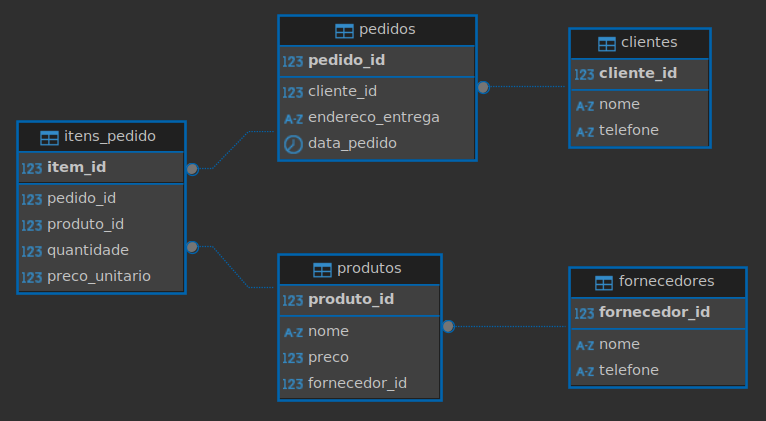

# Violação das formas normais

## Violação da 1ª Forma Normal (1FN)
A primeira forma identifica a existência de atributos multivalorados e atributos compostos, nesse caso precisamos criar uma tabela para armazenar os dados do atributo multivalorado.

Problema: No caso do cliente "Ana". por mais que sejam valores atômicos, é identificado a existência de mais de um atributo, portanto se torna um registro inadequado, levando a quebra das demais formas. Sendo assim, não viola diretamente pelo fato de ter atributos separados, mas por regra isso se tornaria inadequado.

## Violação da 2ª Forma Normal (1FN)
A segunda forma é quando ela implementa os requisitos da primeira forma, e se esses registros dependam de uma chave primária.

Problema: existem registros que não dependem totalmente da chave primária, como por exemplo o telefone, podendo mudar ele sem alterar a dependência dele.

## Violação da 3ª Forma Normal (1FN)
A terceira forma exige estar na primeira e segunda forma, mas identificando quais são os atributos que dependam de outro atributo que não é chave, para que assim possamos criar uma nova tabela apenas com esses regsitros que não dependem da chave primária da tabela principal.

Problema: no caso do telefone, ele depende do nome do cliente, e não do id. Sendo assim, podemos trabalhar com chave estrangeira.

## Entregas:
Os seguintes scripts que foram usados para criação e melhoria da tabela anterior:

CREATE TABLE clientes (
cliente_id SERIAL PRIMARY KEY,
nome VARCHAR(100) NOT NULL,
telefone VARCHAR(20)
);

CREATE TABLE fornecedores (
fornecedor_id SERIAL PRIMARY KEY,
nome VARCHAR(100) NOT NULL,
telefone VARCHAR(20)
);

CREATE TABLE produtos (
produto_id SERIAL PRIMARY KEY,
nome VARCHAR(100) NOT NULL,
preco NUMERIC(10, 2) NOT NULL,
fornecedor_id INT NOT NULL,
CONSTRAINT fk_fornecedor
FOREIGN KEY(fornecedor_id)
REFERENCES fornecedores(fornecedor_id)
);

CREATE TABLE pedidos (
pedido_id SERIAL PRIMARY KEY,
cliente_id INT NOT NULL,
endereco_entrega VARCHAR(200) NOT NULL,
data_pedido TIMESTAMPTZ DEFAULT CURRENT_TIMESTAMP,
CONSTRAINT fk_cliente
FOREIGN KEY(cliente_id)
REFERENCES clientes(cliente_id)
);

CREATE TABLE itens_pedido (
item_id SERIAL PRIMARY KEY,
pedido_id INT NOT NULL,
produto_id INT NOT NULL,
quantidade INT NOT NULL,
preco_unitario NUMERIC(10, 2) NOT NULL,
CONSTRAINT fk_pedido
FOREIGN KEY(pedido_id)
REFERENCES pedidos(pedido_id)
ON DELETE CASCADE,
CONSTRAINT fk_produto
FOREIGN KEY(produto_id)
REFERENCES produtos(produto_id)
);

-- PASSO 1: Inserir os dados nas tabelas independentes

-- Inserindo os clientes
INSERT INTO clientes (nome, telefone) VALUES
('Ana Silva', '9999-0000'),   -- Será cliente_id = 1
('Bruno Costa', '8888-1111'); -- Será cliente_id = 2

-- Inserindo os fornecedores
INSERT INTO fornecedores (nome, telefone) VALUES
('Fornecedor A', '1111-2222'), -- Será fornecedor_id = 1
('Fornecedor B', '3333-4444'); -- Será fornecedor_id = 2

-- PASSO 2: Inserir os produtos, referenciando os IDs dos fornecedores

INSERT INTO produtos (nome, preco, fornecedor_id) VALUES
('Teclado', 150.00, 1), -- Teclado é do Fornecedor A (id=1) | produto_id = 1
('Mouse', 80.00, 2),   -- Mouse é do Fornecedor B (id=2)   | produto_id = 2
('Monitor', 700.00, 1); -- Monitor é do Fornecedor A (id=1) | produto_id = 3

-- PASSO 3: Inserir os pedidos, referenciando os IDs dos clientes

-- No exemplo original, a Ana fez duas compras separadas, então criaremos dois pedidos.
INSERT INTO pedidos (cliente_id, endereco_entrega) VALUES
(1, 'Rua A, 123'), -- Pedido da Ana Silva (cliente_id=1) | pedido_id = 1
(1, 'Rua A, 123'), -- Outro pedido da Ana Silva (cliente_id=1) | pedido_id = 2
(2, 'Rua B, 456'); -- Pedido do Bruno Costa (cliente_id=2) | pedido_id = 3

-- PASSO 4: Inserir os itens dos pedidos, ligando tudo

-- Aqui conectamos os pedidos aos produtos, com suas quantidades e preços
INSERT INTO itens_pedido (pedido_id, produto_id, quantidade, preco_unitario) VALUES
(1, 1, 2, 150.00), -- No pedido 1, foram 2 unidades do produto 1 (Teclado) por 150.00 cada
(2, 2, 1, 80.00),  -- No pedido 2, foi 1 unidade do produto 2 (Mouse) por 80.00
(3, 3, 1, 700.00); -- No pedido 3, foi 1 unidade do produto 3 (Monitor) por 700.00

Esse novo modelo separa clientes, produtos, fornecedores, cada um em sua tabela, eliminando repetição de dados e resolvendo as violações das formas normais. Sendo assim, cada dado é armazenado em seu respectivo lugar, dependendo apenas da chave primária de sua tabela.

Print do diagrama completo:
