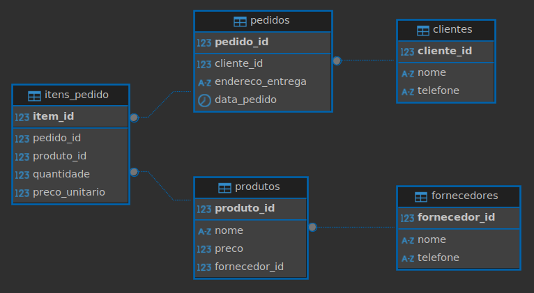

# Violação das formas normais

## Violação da 1ª Forma Normal (1FN)
A Primeira Forma Normal (1FN) exige que todos os atributos sejam atômicos, ou seja, que cada campo de uma tabela contenha apenas um valor indivisível por registro. Isso significa evitar atributos multivalorados ou compostos (como listas de telefones ou endereços em um único campo).

Problema identificado: No caso da cliente Ana, se ela tivesse mais de um telefone registrado em um único campo (por exemplo, '9999-0000, 8888-7777'), estaríamos violando a 1FN. Apesar de o campo telefone conter um único número, se considerarmos que um cliente pode ter múltiplos telefones, o ideal seria mover essa informação para uma tabela associativa (telefones_clientes) para garantir conformidade com a 1FN e permitir flexibilidade futura.

## Violação da 2ª Forma Normal (1FN)
A Segunda Forma Normal (2FN) requer que:
- A tabela esteja na 1FN
- E que todos os atributos não-chave dependam totalmente da chave primária

Essa regra aplica-se especialmente a tabelas que usam chaves primárias compostas (mais de um campo como chave).

Problema identificado: Se tivéssemos uma tabela onde a chave primária fosse composta, por exemplo (cliente_id, produto_id), e armazenássemos o telefone do cliente nessa tabela, o telefone dependeria apenas de cliente_id, e não da chave composta inteira, o que violaria a 2FN.
No modelo atual isso não ocorre, pois os dados estão corretamente divididos entre as tabelas e não há chaves compostas onde essa violação possa acontecer. Ainda assim, é importante ter esse cuidado conceitual.

## Violação da 3ª Forma Normal (1FN)
A Terceira Forma Normal (3FN) exige que:
- A tabela esteja na 2FN
- E que não haja dependência transitiva, ou seja, que nenhum atributo não-chave dependa de outro atributo que também não seja chave

Problema identificado: Um exemplo de violação seria se o telefone de um cliente fosse armazenado em uma tabela onde ele dependesse do nome do cliente, em vez do cliente_id. Isso criaria uma dependência transitiva, pois o telefone dependeria do nome, que por sua vez depende da chave primária.

No modelo atual, o telefone está corretamente associado ao cliente_id, ou seja, à chave primária, e não há essa violação. No entanto, caso o modelo cresça, é importante garantir que os atributos sempre dependam diretamente da chave primária e não de outros atributos intermediários.

## Entregas:
Os seguintes scripts que foram usados para criação e melhoria da tabela anterior:

-- Tabela de clientes
CREATE TABLE clientes (
cliente_id SERIAL PRIMARY KEY,       -- Chave primária
nome VARCHAR(100) NOT NULL,
telefone VARCHAR(20)                 -- Idealmente separado em outra tabela, para permitir múltiplos números
);

-- Tabela de fornecedores
CREATE TABLE fornecedores (
fornecedor_id SERIAL PRIMARY KEY,    -- Chave primária
nome VARCHAR(100) NOT NULL,
telefone VARCHAR(20)                 -- Também pode ser normalizado
);

-- Tabela de produtos
CREATE TABLE produtos (
produto_id SERIAL PRIMARY KEY,       -- Chave primária
nome VARCHAR(100) NOT NULL,
preco NUMERIC(10, 2) NOT NULL,       -- Preço base do produto
fornecedor_id INT NOT NULL,          -- Chave estrangeira
CONSTRAINT fk_fornecedor
FOREIGN KEY(fornecedor_id)
REFERENCES fornecedores(fornecedor_id)
);

-- Tabela de pedidos
CREATE TABLE pedidos (
pedido_id SERIAL PRIMARY KEY,        -- Chave primária
cliente_id INT NOT NULL,             -- Chave estrangeira
endereco_entrega VARCHAR(200) NOT NULL,
data_pedido TIMESTAMPTZ DEFAULT CURRENT_TIMESTAMP,
CONSTRAINT fk_cliente
FOREIGN KEY(cliente_id)
REFERENCES clientes(cliente_id)
);

-- Tabela de itens de pedidos
CREATE TABLE itens_pedido (
item_id SERIAL PRIMARY KEY,           -- Chave primária
pedido_id INT NOT NULL,               -- Chave estrangeira
produto_id INT NOT NULL,              -- Chave estrangeira
quantidade INT NOT NULL,
preco_unitario NUMERIC(10, 2) NOT NULL, -- Preço real da venda no momento do pedido
CONSTRAINT fk_pedido
FOREIGN KEY(pedido_id)
REFERENCES pedidos(pedido_id)
ON DELETE CASCADE,
CONSTRAINT fk_produto
FOREIGN KEY(produto_id)
REFERENCES produtos(produto_id)
);

Esse novo modelo separa clientes, produtos, fornecedores, cada um em sua tabela, eliminando repetição de dados e resolvendo as violações das formas normais. Sendo assim, cada dado é armazenado em seu respectivo lugar, dependendo apenas da chave primária de sua tabela.

Print do diagrama completo:
