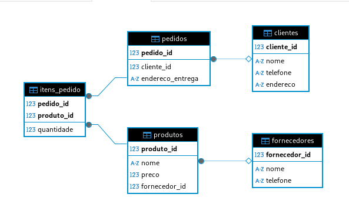

# EVERALDO MARTINS

## Tarefa 02 – Instalação de Banco de Dados, Modelagem e Normalização Prática

## Análise dos problemas do modelo inicial

A tabela `pedidos` apresenta vários problemas de modelagem que violam as formas normais (**1FN**, **2FN** e **3FN**). Listando cada violação identificada:

1. **Violação da 1ª Forma Normal (1FN)**

A **1FN** exige que:

- Todos os atributos sejam atômicos (não divisíveis).
- Não haja grupos repetidos ou listas em uma única coluna.

**Problemas identificados**:

- A tabela `pedidos` armazena informações de clientes, produtos e fornecedores em uma única tabela, mas não há listas ou valores não atômicos (como múltiplos telefones em uma célula). Dessa forma, não existe violação explícita da 1FN nesse caso, já que cada coluna contém um único valor atômico.

2. **Violação da 2ª Forma Normal (2FN)**

A **2FN** exige que:

- A tabela esteja na 1FN.
- Todos os atributos não-chave dependam completamente da chave primária.

**Problemas identificados**:

- A chave primária é `pedido_id`, que identifica exclusivamente cada pedido.
- Atributos como `cliente_nome`, `cliente_telefone`, `fornecedor_nome` e `fornecedor_telefone` dependem de entidades distintas (clientes e fornecedores), não diretamente do `pedido_id`. Por exemplo:

    - `cliente_nome` e `cliente_telefone` dependem do cliente, não do pedido.
    - `fornecedor_nome` e `fornecedor_telefone` dependem do fornecedor, não do pedido.
    
- Isso cria dependências parciais, violando a **2FN**. Esses atributos deveriam estar em tabelas separadas (`clientes` e `fornecedores`).

3. **Violação da 3ª Forma Normal (3FN)**

A **3FN** exige que:

- A tabela esteja na 2FN.
- Não haja dependências transitivas, ou seja, atributos não-chave não devem depender de outros atributos não-chave.

**Problemas identificados**:

- Há uma dependência transitiva:
    - `produto_preco` depende de `produto_nome`, que não é a chave primária. O preço do produto é uma característica do produto, não do pedido especificamente.
    - `endereco_entrega` está relacionado ao cliente, por exemplo (Ana Silva tem o mesmo endereço em dois pedidos), mas está sendo armazenado redundantemente na tabela pedidos.

- Isso causa redundância de dados e potenciais anomalias,  (Por exemplo caso o preço de um produto mude, será necessário atualizar várias linhas).

## Resolução dos problemas do modelo inicial

Para resolver as violações, serão criar tabelas separadas para cada entidade (`clientes`, `fornecedores`, `produtos`, `pedidos` e `itens_pedido`) e usar chaves primárias e estrangeiras para manter a integridade referencial, normalizado até a **3FN**.

**Lista de Tabelas**:

- **clientes**: Armazena informações dos clientes.
- **fornecedores**: Armazena informações dos fornecedores.
- **produtos**: Armazena informações dos produtos.
- **pedidos**: Armazena informações básicas do pedido (ex.: cliente, endereço).
- **itens_pedido**: Relaciona pedidos a produtos (permite múltiplos produtos por pedido).

**Estrutura SQL das tabelas**

```sql
-- Tabela clientes
CREATE TABLE clientes (
    cliente_id SERIAL PRIMARY KEY,
    nome VARCHAR(100) NOT NULL,
    telefone VARCHAR(20),
    endereco VARCHAR(200)
);

-- Tabela fornecedores
CREATE TABLE fornecedores (
    fornecedor_id SERIAL PRIMARY KEY,
    nome VARCHAR(100) NOT NULL,
    telefone VARCHAR(20)
);

-- Tabela produtos
CREATE TABLE produtos (
    produto_id SERIAL PRIMARY KEY,
    nome VARCHAR(100) NOT NULL,
    preco NUMERIC(10,2) NOT NULL,
    fornecedor_id INT REFERENCES fornecedores(fornecedor_id)
);

-- Tabela pedidos
CREATE TABLE pedidos (
    pedido_id SERIAL PRIMARY KEY,
    cliente_id INT REFERENCES clientes(cliente_id),
    endereco_entrega VARCHAR(200)
);

-- Tabela itens_pedido
CREATE TABLE itens_pedido (
    pedido_id INT REFERENCES pedidos(pedido_id),
    produto_id INT REFERENCES produtos(produto_id),
    quantidade INT NOT NULL,
    PRIMARY KEY (pedido_id, produto_id)
);
```

**Inseções exemplos nas tabelas**

```sql
-- Inserir dados em clientes
INSERT INTO clientes (nome, telefone, endereco) VALUES
('Ana Silva', '9999-0000', 'Rua A, 123'),
('Bruno Costa', '8888-1111', 'Rua B, 456');

-- Inserir dados em fornecedores
INSERT INTO fornecedores (nome, telefone) VALUES
('Fornecedor A', '1111-2222'),
('Fornecedor B', '3333-4444');

-- Inserir dados em produtos
INSERT INTO produtos (nome, preco, fornecedor_id) VALUES
('Teclado', 150.00, 1),
('Mouse', 80.00, 2),
('Monitor', 700.00, 1);

-- Inserir dados em pedidos
INSERT INTO pedidos (cliente_id, endereco_entrega) VALUES
(1, 'Rua A, 123'),
(1, 'Rua A, 123'),
(2, 'Rua B, 456');

-- Inserir dados em itens_pedido
INSERT INTO itens_pedido (pedido_id, produto_id, quantidade) VALUES
(1, 1, 2),
(2, 2, 1),
(3, 3, 1);
```
## Explicação da resolução das violações

As violações das forma normais foram resolvidas da seguinte forma:

- **2FN**: Atributos de clientes e fornecedores foram movidos para as tabelas `clientes` e `fornecedores`, eliminando dependências parciais. Agora, cada atributo não-chave depende completamente da chave primária de sua tabela.

- **3FN**: O atributo `produto_preco` foi movido para a tabela `produtos`, eliminando a dependência transitiva com `produto_nome`. O endereço foi mantido em `clientes` como informação padrão, mas `endereco_entrega` em `pedidos` permitindo flexibilidade.

- A tabela `itens_pedido` resolve a questão de múltiplos produtos por pedido, mantendo a integridade referencial com chaves estrangeiras.

## Diagrama Entidade-Relacionamento (DER)

O DER foi gerado no DBeaver, mostrando as tabelas `clientes`, `fornecedores`, `produtos`, `pedidos` e `itens_pedido`, com suas chaves primárias e estrangeiras. 

## Imagem do Diagrama Entidade-Relacionamento (DER)

