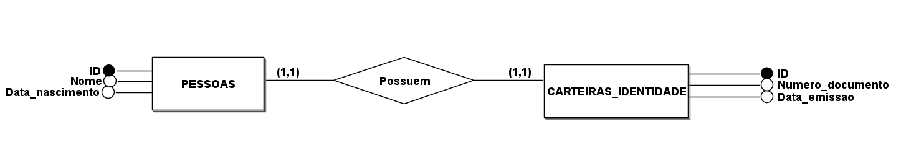
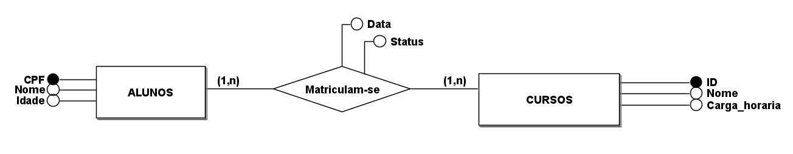

# Tarefa 01

## Apresentação Pessoal

Olá! Meu nome é José Júnior, moro em Santa Luzia na Paraíba, sou técnico em Informática pelo IFPB e graduando em Ciência da Computação pela UEPB, Tenho afinidade pela área de Engenharia e Desenvolvimento de Software, bem como conhecimentos nas linguagens de programação **Python**, **Java**, **JavaScript** e **PHP**; em frameworks e bibliotecas como **Bootstrap**, **React** e **Django**. Também possuo conhecimentos em bancos de dados relacionais como **MySQL** e **PostgreSQL**. Também vale mencionar que estagiei durante 5 meses na empresa *Compass UOL*, onde pude aprender tanto na teoria como na prática, tecnologias como **Blockchain**, **Ethereum** e a linguagem de programação orientada a contratos **Solidity** e métodos ágeis, como o **Scrum**, para a organização e trabalho em equipe; o último mês do Estágio foi dedicado a se preparar para a prova da certificação *Cloud Practitioner* da **AWS**, em que pude adquirir conhecimentos em **Computação em Nuvem** utilizando a plataforma da AWS.

## Estudo Técnico - Banco de Dados Relacional

Um Banco de Dados Relacional é um tipo de banco de dados que segue o **Modelo Relacional**, ou seja, os dados são organizados em **tabelas** (também chamadas de **relações**). Cada tabela possui **linhas** (ou **registros**) e **colunas** (ou **atributos**). Os dados em diferentes tabelas podem se relacionar entre si por meio de **chaves primárias** (*primary keys*) e **chaves estrangeiras** (*foreign keys*), em que a chave primária é utilizada para identificar unicamente cada registro de uma tabela (podendo ser composta por um ou mais atributos) e a chave estrangeira é utilizada para estabelecer relações entre tabelas, apontando para a chave primária de outra tabela.

tomamos como exemplo duas tabelas: `Clientes` e `Pedidos`.

- `Clientes` possui os seguintes atributos: `id`, `nome`, `email`.
- `Pedidos` possui os atributos: `id`, `descricao`, `valor`, `data`, `id_cliente`.

O `id_cliente` em `Pedidos` é uma chave estrangeira que aponta para a chave primária (`id`) da tabela `Clientes`.

Um Banco de Dados pode ser definido como uma coleção organizada de dados armazenados, os quais serão utilizados futuramente; um Sistema Gerenciador de Banco de Dados ou Sistema de Gerenciamento de Banco de Dados (SGBD), por sua vez, é um software que permite criar, gerenciar e manter um banco de dados. Como exemplos de SGBDs temos: `MySQL`, `PostgreSQL` e `SQL Server`.

### Modelagem Relacional

O **Modelo Entidade-Relacionamento** (ER) é uma **representação conceitual** dos dados de um sistema, utilizada na modelagem de banco de dados. Este modelo foi proposto por *Peter Chen* em 1976 e tem como objetivo representar graficamente as informações do mundo real, de forma estruturada e compreensível.

#### Principais elementos do Modelo ER

1. **Entidades**
    - Representam algo do mundo real com existência física ou conceitual;
    - Por exemplo: `Alunos`, `Professores`, `Clientes`, `Produtos`, `Cursos`, `Disciplinas`, `Empresas`, `Consultas`;
    - São representadas como **retângulos** no diagrama.
    
2. **Atributos**
    - São **características** ou **propriedades** que **qualificam as entidades**;
    - Por exemplo: `nome`, `data_nascimento`, `matrícula` são atributos da entidade `Alunos`;
    - São representados no diagrama como **elipses** ligadas à entidade e possuem diversos tipos:
        - **Simples ou atômicos**: indivisíveis (exemplo: `nome`);
        - **Compostos**: podem ser divididos em outros atributos (exemplo: `endereço` &rarr; `rua`, `bairro`);
        - **Multivalorados**: Possuem mais de um valor (exemplo: `telefones`);
        - **Atributo-Identificador**: permite a identificação de cada registro de uma entidade (como exemplo: `cpf` ou `id`).

3. **Relacionamentos**
    - **Conectam duas ou mais entidades** que possuem alguma associação entre si;
    - Por exemplo: `Alunos` **matriculam-se** em `Cursos`;
    - São representados como **losangos** entre as entidades e podem possuir atributos próprios.

4. **Cardinalidade**
    - Define a **quantidade de ocorrências** de um relacionamento entre entidades, especificando a quantidade mínima e quantidade máxima de uma entidade em relação a outra;
    - A cardinalidade máxima **indica o tipo de relacionamento**;
    - A cardinalidade mínima **indica a obrigatoriedade ou não de uma associação**;
    - Entre os tipos de cardinalidade estão:
        - **1:1** (um para um);
        - **1:N** (um para muitos);
        - **N:N** (muitos para muitos).

#### Como as entidades se relacionam

As entidades se relacionam por meio dos relacionamentos, que representam ações ou conexões lógicas entre elas.

**Por exemplo**:  
Entidades: `Pessoas` e `CarteirasIdentidade`;  
Relacionamento: `Possuem`.

- Cada **pessoa** possui no **máximo uma carteira de identidade**;
- Cada **carteira de identidade** pertence **unicamente a uma pessoa**;
- Este é um exemplo de **relacionamento 1:1**.

**Outro exemplo:**  
Entidades: `Fornecedores` e `Produtos`;  
Relacionamento: `Fornecem`.

- Cada **fornecedor** fornece **um ou vários produtos**;
- Cada **produto** é fornecido **por um único fornecedor**;
- Este é um exemplo de **relacionamento 1:N**.

**Outro exemplo:**  
Entidades: `Alunos` e `Cursos`;  
Relacionamento: `Matriculam-se`.

- Um **aluno** pode se matricular em **vários cursos**;
- Cada **curso** pode ter **vários alunos**;
- Este é um exemplo de **relacionamento N:N**.

### Normalização

A Normalização é um **processo sistemático de organização dos dados** em um banco de dados relacional com o objetivo de:  
- Eliminar redundâncias;
- Evitar anomalias na inserção, atualização e exclusão dos dados;
- Garantir a integridade e a consistência dos dados.  

Este processo é implementado a partir da aplicação de um conjunto de regras, denominado **Formas Normais**, proposto pelo matemático *Edward Codd*, na década de 70.

#### 1ª Forma Normal (1FN)
> **Regra**: Eliminar grupos repetitivos e **garantir que todos os atributos sejam atômicos** (sem múltiplos valores em uma mesma célula).  

Dessa forma, uma tabela está na primeira forma normal quando **contém apenas campos atômicos** (campos que não são nem compostos e nem multivalorados).  
Tabelas com colunas como: `telefone1` e `telefone2` ou que armazenam vários valores em uma única célula, como: `produto: "Mouse, Teclado"` violam a atomicidade.

Tomemos como exemplo a seguinte tabela `Funcionários`:

| <u>Matrícula</u> | CPF | Nome | Telefone |  
| :---: | :---: | :---: | :---: |
| 0012 | 08732456743 | JOÃO PEDRO NASCIMENTO | 87273653, 99856373 |
| 0042 | 09347678260 | BIANCA FERREIRA SANTOS | 98736768, 87654656 |
| 0032 | 09745636666 | FERNANDO CAVALCANTI | 98734767 |  

Como solução para esse exemplo, pode-se criar uma tabela para o campo/atributo multivalorado, incluindo uma chave estrangeira para a tabela original:

`Funcionários`
| <u>Matrícula</u> | CPF | Nome | 
| :---: | :---: | :---: |
| 0012 | 08732456743 | JOÃO PEDRO NASCIMENTO |
| 0042 | 09347678260 | BIANCA FERREIRA SANTOS |
| 0032 | 09745636666 | FERNANDO CAVALCANTI |

`Telefones`
| Matrícula (FK) | <u>Telefone</u> |
| :---: | :---: |
| 0012 | 87273653 |
| 0012 | 99856373 |
| 0042 | 98736768 |
| 0042 | 87654656 |
| 0032 | 98734767 |

#### 2ª Forma Normal (2FN)

> **Regra**: Estar na 1FN e **remover dependências parciais** (quando atributos dependem apenas de parte da chave primária composta).

Dessa forma, uma tabela está na segunda formal normal **se estiver na 1FN** e **se os campos dependerem de todos os campos da chave primária composta**.  
Essa FN é aplicável quando a chave primária é composta (por exemplo: `numero` e `codigo_produto`) e há campos que dependem apenas de uma parte da chave.

Tomemos como exemplo a seguinte tabela `Vendas`:

| <u>Numero</u> | <u>Codigo_Produto</u> | Nome_Produto | Valor_Produto | Quantidade | Valor_Total |
| :---: | :---: | :---: | :---: | :---: | :---: |
| 100 | 1 | Caderno | 10,00 | 2 | 20,00 |
| 200 | 2 | Lápis | 1,50 | 3 | 4,50 |
| 300 | 2 | Lápis | 1,50 | 4 | 6,00 |
| 300 | 3 | Livro | 50,00 | 2 | 100,00 |
| 300 | 4 | Etiquetas | 2,50 | 5 | 12,50 |
| 400 | 3 | Livro | 50,00 | 1 | 50,00 |

Como pode-se observar no exemplo acima, os campos `nome_produto` e `valor_produto` dependem funcionalmente de `codigo_produto`, que é parte da chave primária composta.

Como solução para esse exemplo, pode-se criar uma nova tabela que conterá esses campos que dependem apenas de parte (`codigo_produto`) da chave primária composta e a chave primária será o próprio `codigo_produto`:

`Vendas`  
| <u>Numero</u> | <u>Codigo_Produto (FK)</u> | Quantidade | Valor_Total |
| :---: | :---: | :---: | :---: |
| 100 | 1 | 2 | 20,00 |
| 200 | 2 | 3 | 4,50 |
| 300 | 2 | 4 | 6,00 |
| 300 | 3 | 2 | 100,00 |
| 300 | 4 | 5 | 12,50 |
| 400 | 3 | 1 | 50,00 |

`Produtos`
| <u>Codigo_Produto</u> | Nome_Produto | Valor_Produto |
| :---: | :---: | :---: |
| 1 | Caderno | 10,00 |
| 2 | Lápis | 1,50 |
| 2 | Lápis | 1,50 |
| 3 | Livro | 50,00 |
| 4 | Etiquetas | 2,50 |
| 3 | Livro | 50,00 |

#### 3ª Forma Normal (3FN)

> **Regra**: Estar na 2FN e **eliminar dependências transitivas** (quando um atributo depende de outro atributo que não é chave primária).

Dessa forma, uma tabela está na terceira forma normal se estiver na 2FN e não possui dependência transitiva. Por exemplo a tabela `Turmas`:

| <u>Codigo_Turma</u> | Professor | Numero_Sala | Capacidade_Sala |
| :---: | :---: | :---: | :---: |
| 002 | João Ferreira Martins | 101 | 50 |
| 003 | Pedro Cardoso de Melo | 102 | 30 |
| 001 | Pedro Cardoso de Melo | 204 | 25 |
| 025 | Fernando Gomes Silva | 403 | 30 |

Como pode-se observar no exemplo acima, o campo `capacidade_sala` depende funcionalmente do campo `numero_sala`.

Como solução para esse exemplo é criada uma tabela que tem como chave primária o campo determinante (`numero_sala`) e a(s) coluna(s) com dependência transitiva (`capacidade_sala`) é movida para essa nova tabela, tendo como resultado as seguintes tabelas:

`Turmas`
| <u>Codigo_Turma</u> | Professor | <u>Numero_Sala (FK)</u> |
| :---: | :---: | :---: |
| 002 | João Ferreira Martins | 101 |
| 003 | Pedro Cardoso de Melo | 102 |
| 001 | Pedro Cardoso de Melo | 204 |
| 025 | Fernando Gomes Silva | 403 |

`Salas`
| <u>Numero_Sala</u> | Capacidade_Sala |
| :---: | :---: |
| 101 | 50 |
| 102 | 30 |
| 204 | 25 |
| 403 | 30 |

## Referências
Como fontes de estudos para esse estudo técnico foi utilizado o [ChatGPT](https://chatgpt.com/) (que segundo ele, gerou as informações com base em livros clássicos da área de banco de dados como "*Database System Concepts*" de Silberschatz, Korth e Sudarshan e "*Fundamentals of Database Systems*" de Elmasri e Navathe e materiais da internet) e [Anotações](https://github.com/josec-junior/UEPB/tree/main/BancoDeDadosI_2022.2/Anota%C3%A7%C3%B5es) próprias feitas a partir de materiais disponibilizados por professores da Universidade.