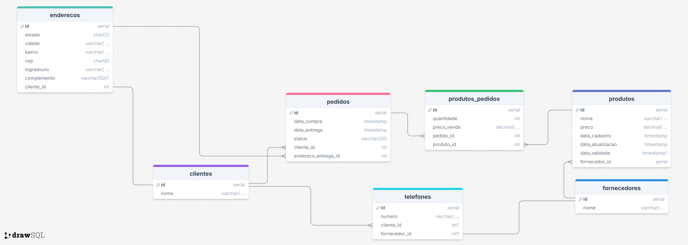

# Tarefa 02 - Instalação de Banco de Dados, Modelagem e Normalização na Prática

Como parte da tarefa foi apresentado o seguinte script SQL contendo uma tabela com problemas de normalização:

```sql

-- Criação do banco de dados
CREATE DATABASE loja;

-- Use o banco criado
\c loja;

-- Tabela com problemas nas formas normais
CREATE TABLE pedidos (
  pedido_id SERIAL PRIMARY KEY,
  cliente_nome VARCHAR(100),
  cliente_telefone VARCHAR(20),
  produto_nome VARCHAR(100),
  produto_preco NUMERIC(10,2),
  quantidade INT,
  fornecedor_nome VARCHAR(100),
  fornecedor_telefone VARCHAR(20),
  endereco_entrega VARCHAR(200)
);

-- Inserindo dados
INSERT INTO pedidos (cliente_nome, cliente_telefone, produto_nome, produto_preco, quantidade, fornecedor_nome, fornecedor_telefone, endereco_entrega) VALUES
('Ana Silva', '9999-0000', 'Teclado', 150.00, 2, 'Fornecedor A', '1111-2222', 'Rua A, 123'),
('Ana Silva', '9999-0000', 'Mouse', 80.00, 1, 'Fornecedor B', '3333-4444', 'Rua A, 123'),
('Bruno Costa', '8888-1111', 'Monitor', 700.00, 1, 'Fornecedor A', '1111-2222', 'Rua B, 456');
```

A partir desse script, foi proposta a análise e identificação de violação das três formas normais, bem como a correção dessas. Antes de começar a análise, eu fiz uma modelagem da tabela criada no script, utilizando a ferramenta online [DrawSQL](https://drawsql.app/)

  
*Obs: No script apresentado, o preço do produto (`produto_preco`) está com o tipo `numeric`, mas como no **DrawSQL** não tinha essa opção, optei por `decimal` mesmo.*

## Análise da Modelagem Inicial

A tabela `pedidos` possui diversas violações às formais normais, iremos ver cada uma detalhadamente:

### 1ª Forma Normal (1FN)

A **1ª Forma Normal** exige que uma tabela possua atributos atômicos (indivisíveis), ou seja, atributos que possuam apenas um valor e não apresente dados repetidos. Apesar da tabela `pedidos` não possuir atributos multivalorados explicitamente, durante a inserção/armazenamento dos dados na tabela, haverá a presença de dados repetidos o que poderá compremeter no desempenho e na manutenção do banco (por exemplo ao tentar atualizar/modificar algum registro).

### 2ª Forma Normal (2FN)

A **2ª Forma Normal** exige que uma tabela esteja na 1FN e não possua **Dependência Funcional Parcial**, ou seja, os atributos não-chave devem depender completamente da chave primária e não apenas de uma parte da chave primária (caso seja uma chave composta), apesar dos atributos não-chave não dependerem "diretamente" da chave primária da tabela (`pedido_id`), a chave primária da tabela não é composta. Dessa maneira, caso estivesse na 1FN, a tabela também poderia está na 2FN já que não possui uma chave primária composta de forma que os atributos dependessem apenas de parte da chave (mesmo que essa tabela apresente alguns problemas de normalização, ao primeiro olhar).

### 3º Forma Normal (3FN)

A **3ª Forma Normal** exige que uma tabela esteja na 2FN e não possua **Dependência Funcional Transitiva**, ou seja, não deve possuir atributos não-chave que dependam de outros atributos não-chave. A tabela `pedidos` possui atributos que dependem de outros atributos que não são chave primária da tabela, como `cliente_telefone` depende de `cliente_nome`, `produto_preco` depende de `produto_nome` e `fornecedor_telefone` depende de `fornecedor_nome`.

## Resolução das Violações das Formas Normas 

Para resolver essas violações, foram criadas novas tabelas de acordo com as entidades desse contexto (como `clientes`, `fornecedores` e `produtos`) e tendo os seus atributos originados a partir de alguns atributos que foram retirados da tabela inicial `pedidos`, acrescidos de chaves e respeitando as Formas Normais. Ficando a modelagem desta forma:



Como pode ser visto na imagem acima, os fornecedores distribuem **um ou vários** produtos, enquanto cada produto é fornecido por um fornecedor **unicamente**. **Um ou vários** clientes podem fazer a compra de **um ou vários** produtos, mas cada pedido é referente a um cliente **unicamente**. Além disso, com a separação dos atributos para as tabelas `clientes`, `fornecedores` e `produtos`, houve a eliminação da possibilidade de ocorrências de **Dependências Funcionais Parciais** e **Dependências Funcionais Transitivas** que ferem as normas 2FN e 3FN respectivamente.

## Script da Modelagem Normalizada

Com isso, o novo script para a modelagem normalizada, o qual é dividido em: criação do banco e seleção/conexão do mesmo, criação das tabelas; Será o seguinte:

```sql
-- Criação do Banco de Dados loja
CREATE DATABASE loja;

-- Selecionando/Conectando ao banco loja
/c loja;

-- Criação da tabela clientes
CREATE TABLE clientes (
	id SERIAL PRIMARY KEY,
	nome VARCHAR(100) NOT NULL,
	telefone VARCHAR(20) NOT NULL,
	endereco_entrega VARCHAR(200) NOT NULL
);

-- Criação da tabela fornecedores
CREATE TABLE fornecedores (
	id SERIAL PRIMARY KEY,
	nome VARCHAR(100) NOT NULL,
	telefone VARCHAR(20) NOT NULL
);

-- Criação da tabela produtos
CREATE TABLE produtos (
	id SERIAL PRIMARY KEY,
	nome VARCHAR(100) NOT NULL,
	preco NUMERIC(10, 2) NOT NULL,
	fornecedor_id INT REFERENCES fornecedores(id)
);

-- Criação da tabela pedidos
CREATE TABLE pedidos (
	id SERIAL PRIMARY KEY,
	quantidade INT NOT NULL,
	cliente_id INT REFERENCES clientes(id),
	produto_id INT REFERENCES produtos(id)
);
```

Após criadas as tabelas, é possível visualizar um Diagrama Entidade-Relacionamento (ER) gerado pelo **DBeaver** (ferramenta sugerida para ser utilizada nessa tarefa, que permite a visualização e o gerenciamento de diversos bancos de dados), baseado nessas tabelas criadas pelo script anterior.


Por fim, podemos inserir os dados em cada uma das tabelas criadas anteriormente, por meio do seguinte script:

```sql
-- Inserindo dados na tabela clientes
INSERT INTO clientes (nome, telefone, endereco_entrega) VALUES
('Ana Silva', '9999-0000', 'Rua A, 123'),
('Bruno Costa', '8888-1111', 'Rua B, 456');

-- Inserindo dados na tabela fornecedores
INSERT INTO fornecedores (nome, telefone) VALUES
('Fornecedor A', '1111-2222'),
('Fornecedor B', '3333-4444');

-- Inserindo dados na tabela produtos
INSERT INTO produtos (nome, preco, fornecedor_id) VALUES
('Teclado', 150.00, 1),
('Mouse', 80.00, 2),
('Monitor', 700.00, 1);

-- Inserindo dados na tabela pedidos
INSERT INTO pedidos (quantidade, cliente_id, produto_id) VALUES
(2, 1, 1),
(1, 1, 2),
(1, 2, 3);
```

Também vale mencionar que apesar de **não fazer parte** do escopo inicial da tarefa, poderiam ser criadas tabelas para os endereços e números de telefone dos clientes e fornecedores.