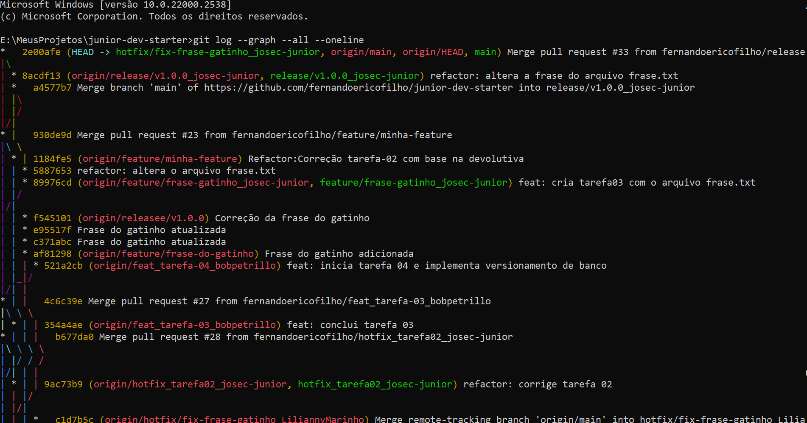
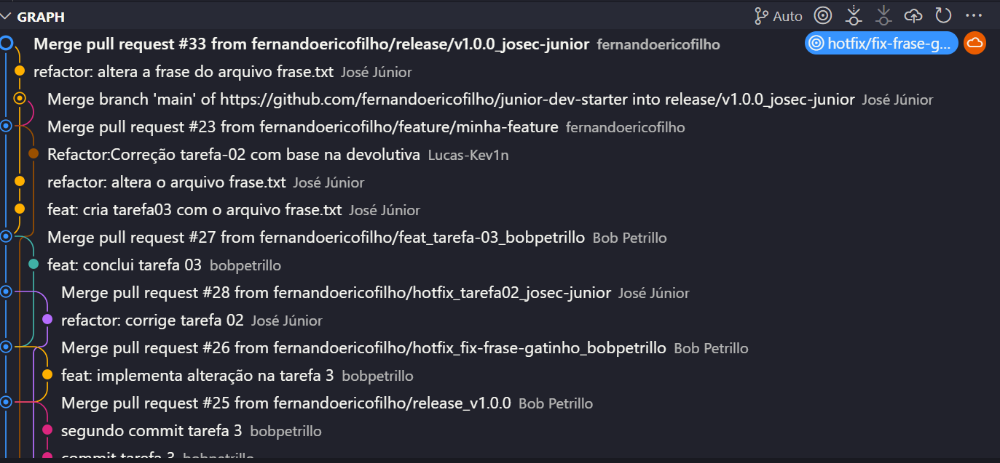

# Tarefa 03 - 🐱 Tarefa de Versionamento com Gitflow

A seguinte tarefa proposta simulou um ambiente de desenvolvimento de software utilizando a metodologia de versionamento de código conhecida como *Git Workflow* ou *GitFlow*.

## Etapas do processo

Inicialmente foi criada a branch `feature/frase-gatinho` simulando uma branch criada para a implementação de uma nova funcionalidade para o projeto (nesse caso foi criado um arquivo txt `frase.txt` contendo a frase "Meu gatinho tomou agua e ficou triste!"). Após criada a branch de *feature* e feito o commit da mesma, foi criada a branch `release/v1.0.0` a partir da branch anterior, e como o nome sugere, trata-se de uma branch responsável por uma *release*/entrega do projeto (nessa branch a frase do arquivo foi alterada para "Meu gatinho tomou leite mas ficou triste!").

Após feito o commit da branch `release/v1.0.0`, foi feito um *Pull Request* (PR) dessa, e com a aprovação do PR, foi feito o *merge* da branch de *release* com a branch `master`. Após feito o *merge* da `release` com a `master`, foi criado uma nova branch a partir dessa (mmaster) chamada `hotfix/fix-frase-gatinho` em que foi modificada a frase do arquivo txt para "Meu gatinho tomou leite e ficou feliz!", em seguida foram feitos o commit e o PR dessa branch, objetivando fazer o merge dessa com a branch `master`.

As imagens abaixo demonstram o fluxo de **commits/branches** que foi feito durante a realização da tarefa proposta, sendo a primeira imagem obtida através do comando `git log --graph --all --oneline` e a segunda é do grafo gerado pela própria IDE do Visual Studio Code.

## Considerações Finais

Apesar de ser uma tarefa simples de realizar, apenas alterando o texto de um arquivo txt, eu pude aprender na prática a metodologia de versionamento de código de um projeto real.