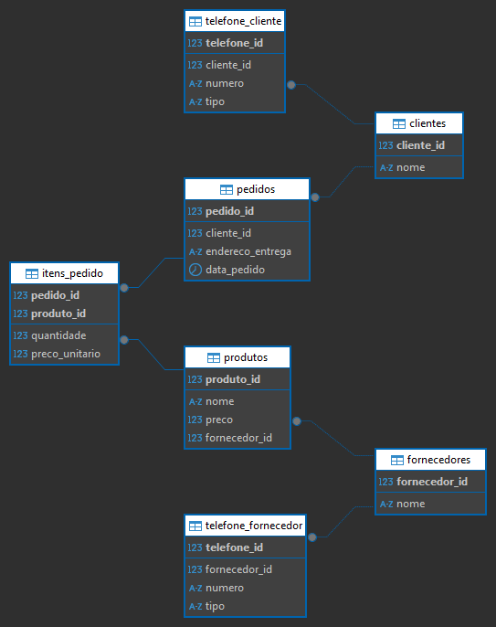

#TAREFA 02

> Na primeiro script, onde temos violações com as regras 1FN, 2FN e 3FN:
**1FN**:
- Dados repetidos como cliente e endereço.
- A tabela mistura **informações de diferentes entidades** (cliente, produto, fornecedor, pedido), violando o princípio da **atomicidade**, pois os dados não estão separados em estruturas independentes.

**2FN**:
- Dados que dependem parcialmente da chave.
- A ausência de uma tabela intermediária para registrar os itens do pedido prejudica o relacionamento **muitos-para-muitos** entre pedidos e produtos.

**3FN**:
- Dados como fornecedor_telefone dependem de fornecedor_nome, e não da chave primária da tabela.
- Isso gera redundância e risco de inconsistência: se o nome do fornecedor for alterado em uma linha e não nas outras, teremos conflitos.

#Normalização
> Para que atenda até a 3°Forma Normal.

- **clientes** (`cliente_id`, `nome`)
- **fornecedores** (`fornecedor_id`, `nome`)
- **produtos** (`produto_id`, `nome`, `preco`, `fornecedor_id`)
- **pedidos** (`pedido_id`, `cliente_id`, `endereco_entrega`, `data_pedido`)
- **itens_pedido** (`pedido_id`, `produto_id`, `quantidade`, `preco_unitario`)
- **telefone_cliente** (`cliente_id`, `numero`, `tipo`)
- **telefone_fornecedor** (`fornecedor_id`, `numero`, `tipo`)

#Explicação
- Cada entidade tem sua **chave primária**.
- Os relacionamentos entre tabelas são feitos com **chaves estrangeiras**.
- A tabela `itens_pedido` resolve o relacionamento muitos-para-muitos entre pedidos e produtos.
- O preço unitário é registrado nos itens do pedido para preservar o **histórico de valores**.

# 📜 Scripts SQL – Criação das Tabelas

-- Criar o banco de dados
CREATE DATABASE loja;

-- Tabela de clientes
CREATE TABLE clientes (
  cliente_id SERIAL PRIMARY KEY,
  nome VARCHAR(100) NOT NULL
);

-- Tabela de fornecedores
CREATE TABLE fornecedores (
  fornecedor_id SERIAL PRIMARY KEY,
  nome VARCHAR(100) NOT NULL
);

-- Tabela de produtos
CREATE TABLE produtos (
  produto_id SERIAL PRIMARY KEY,
  nome VARCHAR(100) NOT NULL,
  preco NUMERIC(10, 2) NOT NULL,
  fornecedor_id INT NOT NULL REFERENCES fornecedores(fornecedor_id)
);

-- Tabela de pedidos
CREATE TABLE pedidos (
  pedido_id SERIAL PRIMARY KEY,
  cliente_id INT NOT NULL REFERENCES clientes(cliente_id),
  endereco_entrega VARCHAR(200),
  data_pedido DATE NOT NULL
);

-- Tabela de itens do pedido (relacionamento entre pedidos e produtos)
CREATE TABLE itens_pedido (
  pedido_id INT NOT NULL REFERENCES pedidos(pedido_id),
  produto_id INT NOT NULL REFERENCES produtos(produto_id),
  quantidade INT NOT NULL,
  preco_unitario NUMERIC(10,2) NOT NULL,
  PRIMARY KEY (pedido_id, produto_id)
);

-- Tabela de telefones dos clientes
CREATE TABLE telefone_cliente (
  telefone_id SERIAL PRIMARY KEY,
  cliente_id INT NOT NULL REFERENCES clientes(cliente_id),
  numero VARCHAR(20) NOT NULL,
  tipo VARCHAR(20) -- Ex: celular, residencial, comercial
);

-- Tabela de telefones dos fornecedores
CREATE TABLE telefone_fornecedor (
  telefone_id SERIAL PRIMARY KEY,
  fornecedor_id INT NOT NULL REFERENCES fornecedores(fornecedor_id),
  numero VARCHAR(20) NOT NULL,
  tipo VARCHAR(20)
);

*Foram inseridos dados ilustrativos para testes*

# Ilustração DER

> Nessa nova estrutura, foi aplicada a normalização, com separação de entidades. O relacionamento entre as tabelas são realizados por chaves estrangeiras, garantindo a integridade referencial. Foi criado a tabela itens_pedido, para resolver a relação de muitos para muitos, entre pedidos e produtos. Os telefones foram armazenados em tabelas separadas, para que permita ter mais de um número por entidade. Dessa forma, a estrutura facilita manutenção, evita redundância e melhora desempenho em consultas.