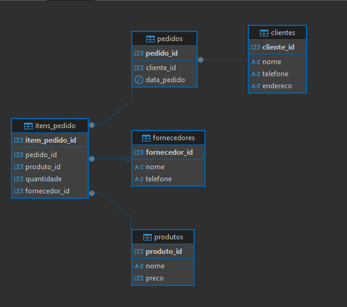

**A análise dos problemas do modelo inicial:**

-- Violação da 2ª Forma Normal (2FN):
A 2FN determina que todos os atributos que não fazem parte da chave primária devem depender totalmente dela. No entanto, isso não acontecia. Informações como o nome e telefone do cliente, o endereço de entrega, o nome e preço do produto, e os dados do fornecedor eram repetidas em vários pedidos.

-- Violação da 3ª Forma Normal (3FN):
A 3FN vai além e diz que os atributos não podem depender uns dos outros — apenas da chave primária. No modelo inicial, isso também não era respeitado. Por exemplo:
    - O telefone e o endereço de entrega estavam ligados ao nome do cliente, e não ao pedido diretamente.
    - O preço dependia do nome do produto.
    - O telefone do fornecedor estava atrelado ao nome do fornecedor.
Essas relações indicam dependências transitivas, o que vai contra as regras da 3FN.

--Quais os problemas práticos disso tudo?--

    - Redundância de dados: Se você comprasse 10 vezes, seus dados pessoais eram armazenados 10 vezes.
    - Perigo de atualização: Se um cliente mudasse de telefone, teria que atualizar manualmente em todos os seus pedidos antigos.
    - Perigo nas inserção: Não dava para cadastrar um produto novo sem fazer um pedido antes.
    - Perigo nas exclusões: Se apagasse um pedido antigo, podia perder informações importantes do cliente ou produto caso não houvesse outros pedidos.

**Os scripts SQL de criação e inserção das tabelas corrigidas.**

-- Criação do banco de dados
CREATE DATABASE loja;

-- Tabela de Clientes
CREATE TABLE clientes (
    cliente_id SERIAL PRIMARY KEY,
    nome VARCHAR(100) NOT NULL,
    telefone VARCHAR(20),
    endereco VARCHAR(200)
);

-- Tabela de Produtos
CREATE TABLE produtos (
    produto_id SERIAL PRIMARY KEY,
    nome VARCHAR(100) NOT NULL,
    preco NUMERIC(10,2) NOT NULL
);

-- Tabela de Fornecedores
CREATE TABLE fornecedores (
    fornecedor_id SERIAL PRIMARY KEY,
    nome VARCHAR(100) NOT NULL,
    telefone VARCHAR(20)
);

-- Tabela de Pedidos
-- 'pedidos' agora contém apenas informações relativas ao pedido e chaves estrangeiras.
CREATE TABLE pedidos (
    pedido_id SERIAL PRIMARY KEY,
    cliente_id INT NOT NULL,
    data_pedido DATE DEFAULT CURRENT_DATE, -- Adicionando uma coluna para a data do pedido
    FOREIGN KEY (cliente_id) REFERENCES clientes(cliente_id)
);

-- Tabela Itens_Pedido (para lidar com a relação N:M entre Pedidos e Produtos)
CREATE TABLE itens_pedido (
    item_pedido_id SERIAL PRIMARY KEY,
    pedido_id INT NOT NULL,
    produto_id INT NOT NULL,
    quantidade INT NOT NULL,
    fornecedor_id INT, -- Opcional: para registrar o fornecedor específico daquele item no pedido
    FOREIGN KEY (pedido_id) REFERENCES pedidos(pedido_id),
    FOREIGN KEY (produto_id) REFERENCES produtos(produto_id),
    FOREIGN KEY (fornecedor_id) REFERENCES fornecedores(fornecedor_id)
);

-- Inserindo dados na tabela clientes
INSERT INTO clientes (nome, telefone, endereco) VALUES
('Ana Silva', '9999-0000', 'Rua A, 123'),
('Bruno Costa', '8888-1111', 'Rua B, 456');

-- Inserindo dados na tabela produtos
INSERT INTO produtos (nome, preco) VALUES
('Teclado', 150.00),
('Mouse', 80.00),
('Monitor', 700.00);

-- Inserindo dados na tabela fornecedores
INSERT INTO fornecedores (nome, telefone) VALUES
('Fornecedor A', '1111-2222'),
('Fornecedor B', '3333-4444');

-- Inserindo dados na tabela pedidos
-- Pedido 1: Ana Silva
INSERT INTO pedidos (cliente_id, data_pedido) VALUES
((SELECT cliente_id FROM clientes WHERE nome = 'Ana Silva'), '2023-01-10');

-- Pedido 2: Ana Silva
INSERT INTO pedidos (cliente_id, data_pedido) VALUES
((SELECT cliente_id FROM clientes WHERE nome = 'Ana Silva'), '2023-01-12');

-- Pedido 3: Bruno Costa
INSERT INTO pedidos (cliente_id, data_pedido) VALUES
((SELECT cliente_id FROM clientes WHERE nome = 'Bruno Costa'), '2023-01-15');

-- Inserindo dados na tabela itens_pedido
-- Detalhes do Pedido 1 (Ana Silva)
INSERT INTO itens_pedido (pedido_id, produto_id, quantidade, fornecedor_id) VALUES
((SELECT pedido_id FROM pedidos WHERE cliente_id = (SELECT cliente_id FROM clientes WHERE nome = 'Ana Silva') ORDER BY pedido_id LIMIT 1),
 (SELECT produto_id FROM produtos WHERE nome = 'Teclado'),
 2,
 (SELECT fornecedor_id FROM fornecedores WHERE nome = 'Fornecedor A'));

-- Detalhes do Pedido 2 (Ana Silva)
INSERT INTO itens_pedido (pedido_id, produto_id, quantidade, fornecedor_id) VALUES
((SELECT pedido_id FROM pedidos WHERE cliente_id = (SELECT cliente_id FROM clientes WHERE nome = 'Ana Silva') ORDER BY pedido_id DESC LIMIT 1),
 (SELECT produto_id FROM produtos WHERE nome = 'Mouse'),
 1,
 (SELECT fornecedor_id FROM fornecedores WHERE nome = 'Fornecedor B'));

-- Detalhes do Pedido 3 (Bruno Costa)
INSERT INTO itens_pedido (pedido_id, produto_id, quantidade, fornecedor_id) VALUES
((SELECT pedido_id FROM pedidos WHERE cliente_id = (SELECT cliente_id FROM clientes WHERE nome = 'Bruno Costa')),
 (SELECT produto_id FROM produtos WHERE nome = 'Monitor'),
 1,
 (SELECT fornecedor_id FROM fornecedores WHERE nome = 'Fornecedor A'));

**Um breve texto explicando como seu novo modelo resolve as violações de normalização.**

-- Resolução da 2ª Forma Normal (2FN):
    - Clientes, produtos e fornecedores foram movidos para tabelas independentes, cada uma com sua própria chave primária (ID).
    - A tabela de pedidos agora armazena apenas IDs de referência (como cliente_id), evitando duplicação de dados.
    - Dessa forma, cada campo depende inteiramente da chave primária de sua tabela, cumprindo a 2FN.

-- Resolução da 3ª Forma Normal (3FN)
    - Telefone e endereço agora estão diretamente associados ao cliente_id, não ao nome.  
    - Preço do produto está vinculado ao produto_id, não ao nome do item.
    - Telefone do fornecedor referencia apenas o fornecedor_id.

-- Resultado Final
    O novo modelo elimina redundâncias, previne anomalias de inserção, atualização e exclusão, e garante que os dados estejam sempre consistentes, seguindo as boas práticas de normalização de bancos de dados.

