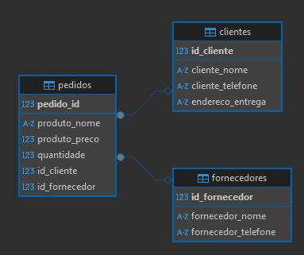

# Tarefa 02 - Modelagem e Normalização de Banco de Dados


---

##  Análise dos Problemas

###  1ª Forma Normal (1FN)

* Presença de dados repetidos (nome e telefone do cliente, nome do fornecedor).

###  2ª Forma Normal (2FN)

* Dados do cliente e fornecedor dependem apenas parcialmente da chave primária `pedido_id`, violando a 2FN.

###  3ª Forma Normal (3FN)

* Informações do cliente e fornecedor dependem de atributos que não são chave (dependência transitiva).

---

##  Modelo Corrigido (Normalizado)

### Tabela: `cliente`

```sql
CREATE TABLE cliente (
  id SERIAL PRIMARY KEY,
  nome TEXT NOT NULL,
  cpf VARCHAR(14) UNIQUE,
  data_cadastro DATE DEFAULT CURRENT_DATE
);
```

### Tabela: `fornecedor`

```sql
CREATE TABLE fornecedor (
  id SERIAL PRIMARY KEY,
  nome TEXT NOT NULL,
  cnpj VARCHAR(18) UNIQUE,
  data_cadastro DATE DEFAULT CURRENT_DATE
);
```

### Tabela: `endereco`

```sql
CREATE TABLE endereco (
  id SERIAL PRIMARY KEY,
  cliente_id INT REFERENCES cliente(id) ON DELETE CASCADE,
  logradouro TEXT NOT NULL,
  numero TEXT NOT NULL,
  bairro TEXT,
  cidade TEXT NOT NULL,
  estado CHAR(2),
  cep VARCHAR(10)
);
```

### Tabela: `telefone`

```sql
CREATE TABLE telefone (
  id SERIAL PRIMARY KEY,
  numero VARCHAR(20) NOT NULL,
  tipo TEXT, -- ex: celular, fixo, whatsapp
  cliente_id INT REFERENCES cliente(id) ON DELETE CASCADE,
  fornecedor_id INT REFERENCES fornecedor(id) ON DELETE CASCADE
);
```

### Tabela: `produtos`

```sql
CREATE TABLE produtos (
  id SERIAL PRIMARY KEY,
  nome TEXT NOT NULL,
  preco NUMERIC(10, 2) NOT NULL,
  data_cadastro DATE DEFAULT CURRENT_DATE,
  data_validade DATE,
  fornecedor_id INT REFERENCES fornecedor(id) ON DELETE SET NULL
);
```

### Tabela: `pedidos`

```sql
CREATE TABLE pedidos (
  id SERIAL PRIMARY KEY,
  cliente_id INT REFERENCES cliente(id) ON DELETE CASCADE,
  data_pedido DATE DEFAULT CURRENT_DATE
);
```

### Tabela: `itens_pedido`

```sql
CREATE TABLE itens_pedido (
  id SERIAL PRIMARY KEY,
  pedido_id INT REFERENCES pedidos(id) ON DELETE CASCADE,
  produto_id INT REFERENCES produtos(id) ON DELETE SET NULL,
  quantidade INT NOT NULL,
  valor_unitario NUMERIC(10, 2) NOT NULL
);
```

---

##  Inserção de Dados

```sql
-- Cliente
INSERT INTO cliente (nome, cpf) VALUES
('Ana Silva', '123.456.789-00'),
('Bruno Costa', '987.654.321-00');

-- Fornecedor
INSERT INTO fornecedor (nome, cnpj) VALUES
('Fornecedor A', '12.345.678/0001-00'),
('Fornecedor B', '98.765.432/0001-00');

-- Endereco
INSERT INTO endereco (cliente_id, logradouro, numero, bairro, cidade, estado, cep) VALUES
(1, 'Rua A', '123', 'Bairro A', 'São Paulo', 'SP', '01234-567'),
(2, 'Rua B', '456', 'Bairro B', 'São Paulo', 'SP', '07654-321');

-- Telefones de clientes
INSERT INTO telefone (numero, tipo, cliente_id) VALUES
('9999-0000', 'celular', 1),
('8888-1111', 'fixo', 2);

-- Telefones de fornecedores
INSERT INTO telefone (numero, tipo, fornecedor_id) VALUES
('1111-2222', 'celular', 1),
('3333-4444', 'fixo', 2);

-- Produtos
INSERT INTO produtos (nome, preco, data_validade, fornecedor_id) VALUES
('Teclado', 150.00, '2026-12-31', 1),
('Mouse', 80.00, '2026-12-31', 2),
('Monitor', 700.00, '2027-06-30', 1);

-- Pedidos
INSERT INTO pedidos (cliente_id, data_pedido) VALUES
(1, '2025-07-12'),
(2, '2025-07-12');

-- Itens_pedido
INSERT INTO itens_pedido (pedido_id, produto_id, quantidade, valor_unitario) VALUES
(1, 1, 2, 150.00),  -- Pedido 1 tem 2 teclados
(1, 2, 1, 80.00),   -- Pedido 1 tem 1 mouse
(2, 3, 1, 700.00);  -- Pedido 2 tem 1 monitor
```

---

##  Como o modelo foi normalizado

* **1FN**: Os dados foram divididos em tabelas com colunas atômicas (sem valores compostos ou repetidos).
* **2FN**: Todos os dados em cada tabela dependem unicamente de sua chave primária.
* **3FN**: Nenhuma coluna depende de outra coluna que não seja chave primária.

---

##  Diagrama Entidade-Relacionamento



---

##  Fontes Utilizadas

* https://www.youtube.com/watch?v=eRaAMNjCFYw
* https://www.youtube.com/watch?v=6ER9lWOk-cY&t=443s
* https://www.youtube.com/watch?v=usA8QKvEHWw&t=441s

---

##  Conclusão

O exercício permitiu identificar problemas comuns de modelagem em bancos relacionais, aplicar as três primeiras formas normais e criar um modelo eficiente e claro com o uso de chaves primárias, estrangeiras e separação de entidades.

