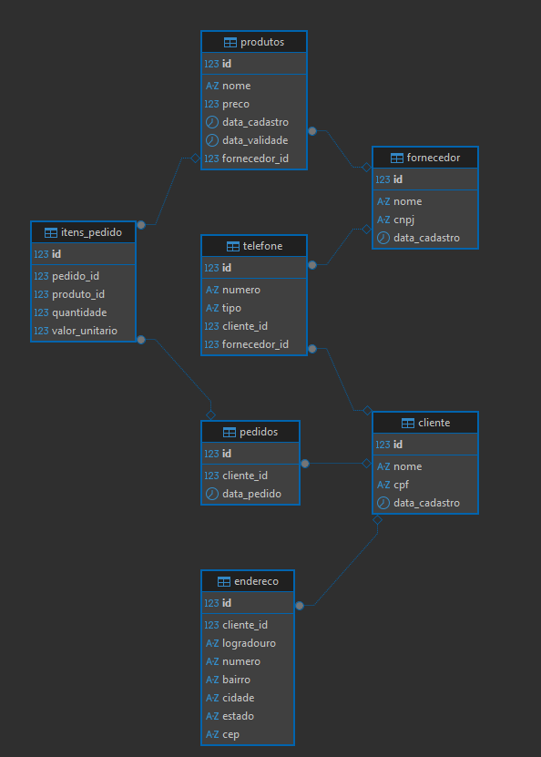

# Tarefa 02 - Modelagem e Normalização de Banco de Dados


---

##  Análise dos Problemas

###  1ª Forma Normal (1FN)

* Presença de dados repetidos (nome e telefone do cliente, nome do fornecedor).

###  2ª Forma Normal (2FN)

* Dados do cliente e fornecedor dependem apenas parcialmente da chave primária `pedido_id`, violando a 2FN.

###  3ª Forma Normal (3FN)

* Informações do cliente e fornecedor dependem de atributos que não são chave (dependência transitiva).

---

##  Modelo Corrigido (Normalizado)

### Tabela: `clientes`

```sql
CREATE TABLE clientes (
  id_cliente SERIAL PRIMARY KEY,
  cliente_nome VARCHAR(100),
  cliente_telefone VARCHAR(20),
  endereco_entrega VARCHAR(200)
);
```

### Tabela: `fornecedores`

```sql
CREATE TABLE fornecedores (
  id_fornecedor SERIAL PRIMARY KEY,
  fornecedor_nome VARCHAR(100),
  fornecedor_telefone VARCHAR(20)
);
```

### Tabela: `pedidos`

```sql
CREATE TABLE pedidos (
  pedido_id SERIAL PRIMARY KEY,
  produto_nome VARCHAR(100),
  produto_preco NUMERIC(10,2),
  quantidade INT,
  id_cliente INT REFERENCES clientes(id_cliente),
  id_fornecedor INT REFERENCES fornecedores(id_fornecedor)
);
```

---

##  Inserção de Dados

```sql
-- Clientes
INSERT INTO clientes (cliente_nome, cliente_telefone, endereco_entrega) VALUES
('Ana Silva', '9999-0000', 'Rua A, 123'),
('Bruno Costa', '8888-1111', 'Rua B, 456');

-- Fornecedores
INSERT INTO fornecedores (fornecedor_nome, fornecedor_telefone) VALUES
('Fornecedor A', '1111-2222'),
('Fornecedor B', '3333-4444');

-- Pedidos
INSERT INTO pedidos (produto_nome, produto_preco, quantidade, id_cliente, id_fornecedor) VALUES
('Teclado', 150.00, 2, 1, 1),
('Mouse', 80.00, 1, 1, 2),
('Monitor', 700.00, 1, 2, 1);
```

---

##  Como o modelo foi normalizado

Realizei o esboço do projeto primeiramente em planilha para facilitar a visualização e remanejamento de dados. 

> **

* **1FN**: Os dados foram divididos em tabelas com colunas atômicas (sem valores compostos ou repetidos).
* **2FN**: Todos os dados em cada tabela dependem unicamente de sua chave primária.
* **3FN**: Nenhuma coluna depende de outra coluna que não seja chave primária.

---

##  Diagrama Entidade-Relacionamento

> **

---

##  Fontes Utilizadas

* https://www.youtube.com/watch?v=eRaAMNjCFYw
* https://www.youtube.com/watch?v=6ER9lWOk-cY&t=443s
* https://www.youtube.com/watch?v=usA8QKvEHWw&t=441s

---

##  Conclusão

O exercício permitiu identificar problemas comuns de modelagem em bancos relacionais, aplicar as três primeiras formas normais e criar um modelo eficiente e claro com o uso de chaves primárias, estrangeiras e separação de entidades.
